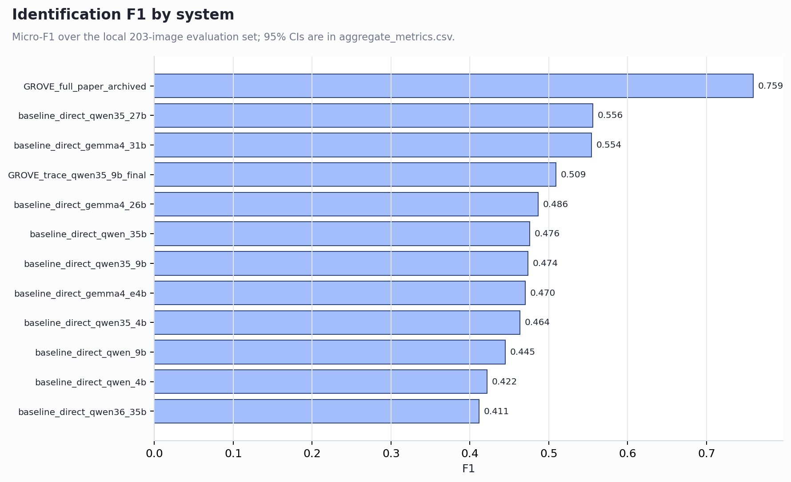

# GROVE: AI for Construction Safety

This public research companion contains the reproducibility scripts and
paper-facing evidence package for **GROVE: Grounded OSHA Violation Evaluator
for Construction Hazard Detection and Spatial Grounding**.



## Best Evidence

- **What I built:** a sanitized evidence package for grounded construction
  hazard detection, ablations, paired tests, threshold sensitivity, and claim
  traceability.
- **What is reproduced:** report generation, evidence tables, figures, and
  consistency checks from committed permitted evidence.
- **What is unavailable:** source images, model weights, private coauthor
  materials, and archived raw inference runs.
- **Main verified result:** GROVE identification F1 is `0.7591`; the best
  evaluated single-pass baseline F1 is `0.5558`, with paired difference
  `+0.2047` and `p < 0.001`.
- **How to verify:** `uv sync --frozen && make test && make reproduce-smoke`.

The repository preserves completed experiments, statistical comparisons,
claim traceability, failure attribution, threshold sensitivity, and explicit
`NOT_RUN` records. It does not include source images, model weights, private
coauthor material, or archived raw inference runs.

## Headline Evidence

- Identification F1: `0.7591` (95% CI `[0.7014, 0.8077]`)
- Best evaluated single-pass baseline F1: `0.5558`
- Paired F1 difference: `+0.2047` (95% CI `[0.1353, 0.2728]`, `p < 0.001`)
- GROVE IoU@0.5: `0.5101`; evaluated baseline: `0.2267`

These figures are copied from the committed evidence package and should be
interpreted with the limitations in `EVIDENCE_PACKAGE.md`.

## Reproduce the Evidence Report

```bash
uv sync
make test
make reproduce-smoke
make reproduce-results
```

The evidence package distinguishes computed, cached, post-hoc, proxy, and
`NOT_RUN` rows. The public repository is a sanitized companion: source images,
private raw inference runs, model weights, and coauthor-only materials are not
redistributed.

This repository accompanies ongoing collaborative research. Publication
metadata and the final paper citation will be added after manuscript release.
